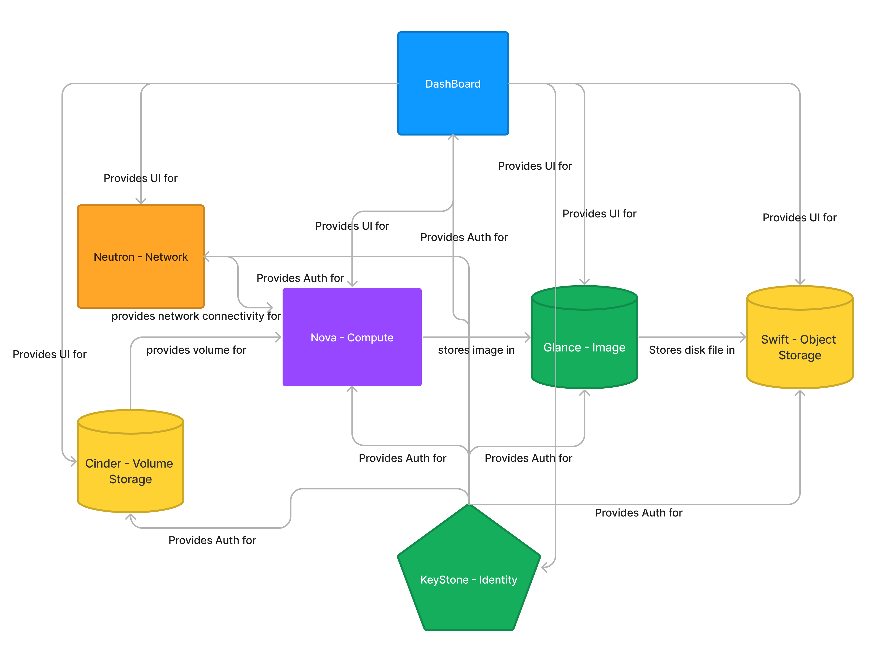

<br/>
<p align="center">
  <a href="https://github.com/jawad-nsu/open_stack_architecture">
    
  </a>

  <h3 align="center">OpenStack Notes</h3>

  <p align="center">
    Openstack notes, resources, code
    <br/>
    <br/>
    <a href="https://github.com/jawad-nsu/open_stack_architecture"><strong>View Demo »</strong></a>
    <br/>
    <br/>
    <a href="https://github.com/jawad-nsu/open_stack_architecture">Explore the docs</a>
    .
    <a href="https://github.com/jawad-nsu/open_stack_architecture/issues">Report Bug</a>
    .
    <a href="https://github.com/jawad-nsu/open_stack_architecture/issues">Request Feature</a>
  </p>
</p>

    [](https://discord.gg/6Kf422a)

## Table Of Contents

- [Table Of Contents](#table-of-contents)
- [About The Project](#about-the-project)
- [Built With](#built-with)
- [Getting Started](#getting-started)
  - [Prerequisites](#prerequisites)
  - [Installation](#installation)
- [Usage](#usage)
- [Roadmap](#roadmap)
- [Contributing](#contributing)
  - [Creating A Pull Request](#creating-a-pull-request)
- [License](#license)
- [Authors](#authors)
- [Acknowledgements](#acknowledgements)

## About The Project



OpenStack’s promise is not just powering private cloud, it’s also the building platform for network functions virtualization transforming into an NFV

- Keystone:

1. Identity provider service. Authentication and Authorization.
   a. It provides auth not just to user but to different service component as well.
2. Where all the services get registered to as the central registration point. It provides catalog to services and users so that they know how to reach open stack services.

- Glance:

1. Image management. Stores and retrieves virtual machine images. Open stack compute makes use of this during instance provisioning. When an VM starts, it must have a image behind it. We need to prebuild the images and load them into glance beforehand so that when the VM starts, it goes out to glance and pulls a copy of the image from there, instead of having to go through the whole installation process each time, it’s preinstalled and ready to go.

- Neutron:

1. Open Stack networking and will create that virtual network and attach the VM to it.
2. Enables network connectivity as a service for other open stack services, such as Open Stack Compute and has a pluggable architecture that supports many popular networking vendors and technologies. Very extensible

Once you’re authenticated, and have a image and a network available, Nova will step in.

- Nova:

1. Nova manages the life cycle of compute instances in open, static environment. Some of it’s capabilities include launching, migrating, pausing, resizing and decommissioning of virtual machine on demand. Nova is the layer on top of the hypervisor and it’s the one that coordinates all that network, storage and compute resources we have in cloud. It coordinates them together. Talks with the hypervisor and makes sure that you’re machine are launched

- Cinder:

1. Volumn storage. Cinder provides persistant block storage to running instances. Normally, the virtual machines boot up with ephemeral volumes. That means when we terminate the VM, the data within the VM’s get lost. If you need to keep the data when it’s terminated, attach a persistent block device to those VM’s so that VM can write the information that needs to persist on that volume. When the VM’s get terminated, you’re able to reattach that block volume device to another instance. This provides the ability to continue using the information that you had in the terminated instance.
2. This isn’t shared storage, it’s block storage, meaning there is a one-to-one relationship between the volume and the instance. There’s a separate shared storage project called **Manilla**. Which provides shared file system for VM’s

- Swift:

1. Object storage. Store and retrive simple objects like an `mpeg4` video file it uses an HTTP based API, where you pass objects and metadata with regular **HTTP** `GET` and `PUT` commands. Basic file storage but can be very powerful. Simple, Flexible, and Scalable.

- Dashboard:

1. Based on project Horizon, which is more of a framework. Provides web based self-service portal to interact with underlying open stack services such as launching an instance, assigning IP addresses, configuring access controls and so on.

## Built With

Whilst I was the main developer of this project, this project couldn't of even started without the help of these open source projects, special thanks to:

- [JavaScript](https://www.javascript.com/)
- [VueJS](https://vuejs.org/)

## Getting Started

This is an example of how you may give instructions on setting up your project locally.
To get a local copy up and running follow these simple example steps.

### Prerequisites

This program has no pre-requisites

### Installation

1. Clone the repo

```sh
git clone https://github.com/jawad-nsu/open_stack_architecture.git
```

2. Open The index.HTML file

3. Have fun!

## Usage

Coming Soon!

## Roadmap

See the [open issues](https://github.com/jawad-nsu/open_stack_architecture/issues) for a list of proposed features (and known issues).

## Contributing

Contributions are what make the open source community such an amazing place to be learn, inspire, and create. Any contributions you make are **greatly appreciated**.

- If you have suggestions for adding or removing projects, feel free to [open an issue](https://github.com/jawad-nsu/open_stack_architecture/issues/new) to discuss it, or directly create a pull request after you edit the files with necessary changes.
- Create individual PR for each suggestion.
- Please also read through the [Code Of Conduct](https://github.com/jawad-nsu/open_stack_architecture/blob/main/CODE_OF_CONDUCT.md) before posting your first idea as well.

### Creating A Pull Request

1. Fork the Project
2. Create your Feature Branch (`git checkout -b feature/AmazingFeature`)
3. Commit your Changes (`git commit -m 'Add some AmazingFeature'`)
4. Push to the Branch (`git push origin feature/AmazingFeature`)
5. Open a Pull Request

## License

Distributed under the MIT License. See [LICENSE](https://github.com/jawad-nsu/open_stack_architecture/blob/main/LICENSE.md) for more information.

## Authors

- **Jawad Rahim** - _Software Engineer_ - [Jawad Rahim](https://github.com/jawad-nsu) - _Open Stack notes_

## Acknowledgements

- [Ugur Oktay](https://github.com/uguroktay)
